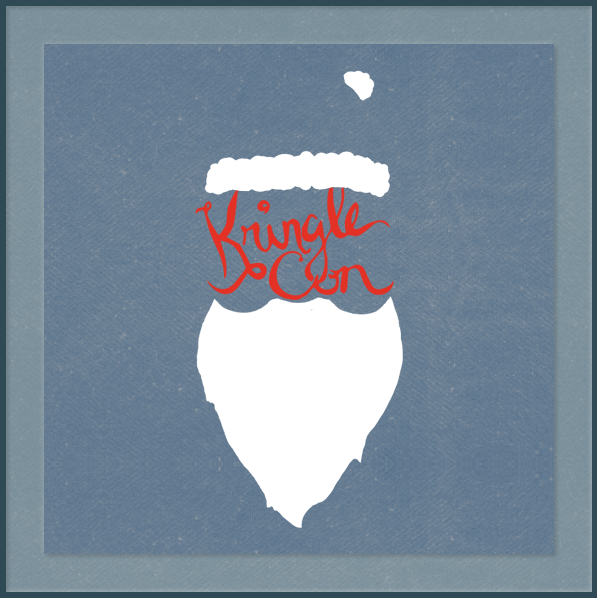

KringleCon Solves
===================

This repository is for documenting my solutions to the objectives and Cranberry Pi terminal challenges of the [SANS Holiday Hack Challenge & KringleCon](https://www.sans.org/holidayhack/). I do not profess to have the best or most elegant solution but hopefully in documenting my thought process, it will help out others who are new to Capture-the-Flag (CTF) challenges in gaining insights on how to approach such questions.

The [SANS Holiday Hack Challenge](https://kringlecon.com/) is one of the best and most fun CTF year round in my opinion as there are helpful hints and [KringleCon talks](https://www.youtube.com/KringleCon) to guide you along. And if one is still stuck, the friendly community on the [SANS Holiday Hack Challenge Discord server](https://discord.gg/Wbmx92rWW3) is always available to provided additional nudges.

Available Write-ups
--------------------
